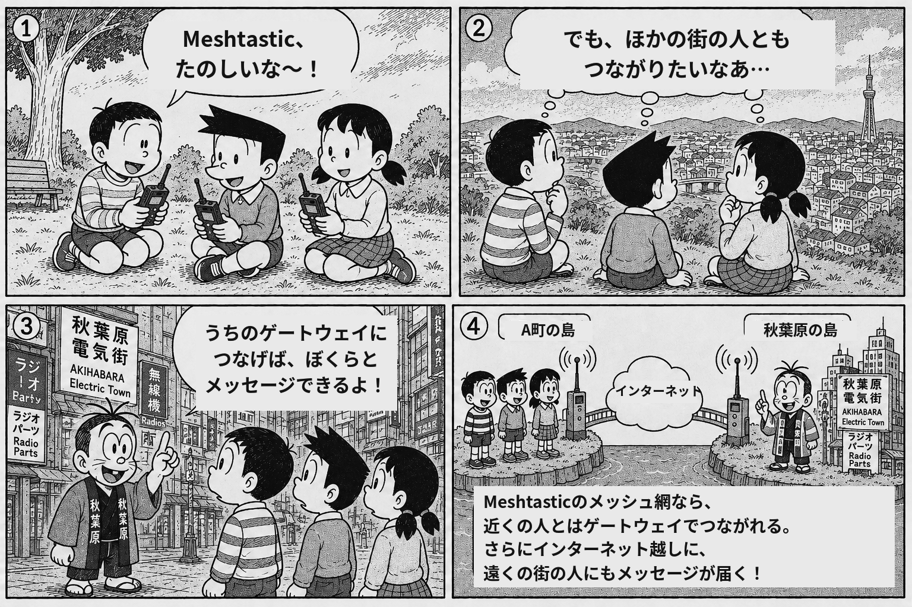
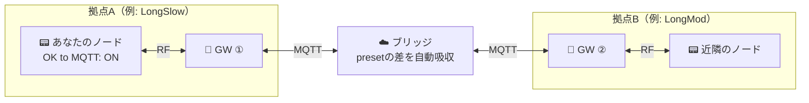

# 🛰️ ptp mesh

日本はノードが少なくせっかく購入したmeshtasticデバイスも通信相手が見つからないことがほとんど。
初めての通信相手はもう一台追加購入した自分のデバイス。
MQTT公式ブローカーに接続しても0hopで単なるネットメッセージ端末になりはてます。
なので、拠点同士をpreset（LongFast / LongMod / LongSlow …）が違っても、マルチホップで繋ぐ実験的な Meshtastic MQTT ブリッジをつくりました。

参加方式は公式パブリック MQTT と同じ「オープン参加」— サーバーに接続すれば誰でも使えます。

{ loading=lazy }

[参加方法を見る](connect.md){ .md-button .md-button--primary }
[公式マップに載せる](map.md){ .md-button }

## どういう仕組み？

各地の Meshtastic ノード（ゲートウェイ = GW）が MQTT サーバーに接続し、拾った電波をお互いの拠点で RF 再放射し合います。ブリッジがチャンネルハッシュを宛先の preset に合わせて自動書換するので、**拠点ごとに地域最適な preset を使ったまま**繋がります。

図のように、あなたのノード自身は MQTT に繋がっていなくても、**GW の電波圏内にいれば参加できます**（LoRa 設定の「OK to MQTT」を ON にするだけ。[詳細](connect.md)）。

## 「グループ」= root topic の考え方（2層モデル）

root topic はメッセージの届く範囲を決める**グループ名**です。GW はそのグループへの**出入り口**（電波の窓口）で、1 つのグループに複数の GW がぶら下がれます。

- **配送 = root topic**：同じ root の人にだけ届きます。`ptp/commons` は公開の“周知のグループ”、`ptp/<好きな名前>` は独立した自分のグループ。まずは **`ptp/commons`** がおすすめ。
- **秘匿 = PSK**：commons は既定 PSK（`AQ==`）＝誰でも読める公開の場。自分のグループを私的にしたいなら、名前付きチャンネル＋**独自 PSK** を追加してください（root 分離＋PSK で本当の私的グループになります）。

## 現在の常設ゲートウェイ

東京の 方南町・千駄ヶ谷・秋葉原 で常設GWが稼働中です（一部は夜間停止）。

!!! warning "実験運用です"
    有志による実験ネットワークです。予告なく止まる・仕様が変わることがあります。フィードバック歓迎。
